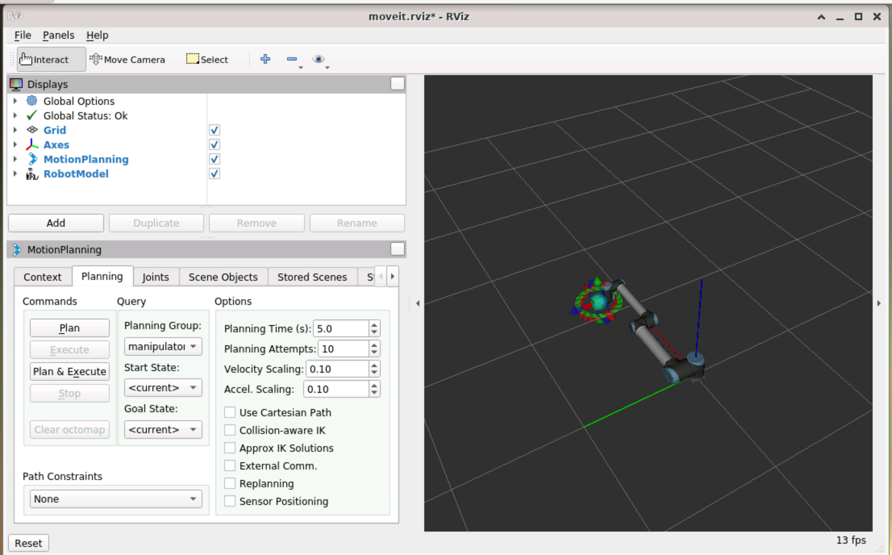

# Pick and Place - Moveit + UR10 + PG_70 gripper

Como executar:
Você pode executar em sua máquina local ou via GitHub Codespaces. Se for executar no seu computador é necessária a preparação do ambiente local, caso contrário vá para a seção ["Tutorial Via GitHub Codespaces"](#tutorial-via-github-codespaces).

## Preparação do ambiente na máquina local - git + docker + vscode

1. Verifique se o git está instalado

    ```bash
    git --version
    ```

    1.1 - Se não estiver instalar:

    ```bash
    sudo apt install git
    ```

2. Baixar o repositorio em sua máquina local:

    ```bash
    git clone https://github.com/NURIA-IFSP/LabVir_moveit_ur10_lab1.git
    ```

3. Abrir o vscode no diretório do projeto:

    ```bash
    code LabVir_moveit_ur10_moveit_lab01
    ```

4. Garanta que o docker esteja instalado e rodando:

    ```bash
        docker --version
    ```

5. Se não tiver, instalar o docker:

    [Docker Installation Guide](https://docs.docker.com/get-started/get-docker/)

6. Instale a extensão remote - developement: workspace, no vscode:

    - No menu de extensões do VsCode Ctrl + Shift + X procure por: Remote - Development: Workspace

## Execução do container no vscode

1. Clique no botão de play no canto inferior esquerdo do vscode:
    

2. Clique em "Reopen in Container"

3. Aguarde o container ser iniciado, o vscode irá reiniciar e abrir novamente. (Isso deve levar alguns minutos)

## Abra o ambiente de desenvolvimento no seu browser

1. Abra o terminal PORTS do vscode com o atalho: Ctrl + Shift + P - Forward a Port

2. Clique na primeira porta que estará mapeada no endereço:  <http://localhost:6080>

3. O ambiente XFCE4 deverá abrir no seu browser

4. Se desejar, ajuste a resolução para o seu monitor clicando no canto superior esquerdo do ambiente XFCE4 e selecionando "Display Settings"

5. Clique no botão para estender a exibição para a tela inteira - atalho: Ctrl + Shift + F12

6. Clique no ícone da área de trabalho - "Init_ROS"

    Isso deverá abrir o terminal e exibir a preparação do ambiente ROS (deve levar alguns minutos.)

    **Importante: Só há necessidade do init_ros quando for iniciar o ambiente remoto no 1o acesso, nos demais acessos o ambiente**
   

7. Abra um terminal "Applications -> Terminal Emulator"

8. Mude para o diretorio /LabVir_moveit_ur10_lab1_new/catkin_ws

## Visualização do braço robótico no Rviz com o MoveIt

9. Execute o comando:

```bash
    cd catkin_ws
    source devel/setup.bash
    roslaunch ur10_gripper_config demo.launch
```
    
O RViz deverá abrir com esta tela:



Perceba que o MoveIt está carregado pois o Motion Planning está sendo exibido.


### Utilizando o MoveIt Motion Planner para movimentação do braço robótico

Através do motion planning você poderá planejar a movimentação do braço robótico. Para isso:

    1. Escolha o grupo (aba "Planning Group") que vai ser movimentado - Manipulator ou gripper
    2. Escolha a posição desejada _"Goal state"_
    3. Clique em _Plan_ para realizar o planejamento da rota e em _Execute_ para movimentar o manipulador
    4. O manipulador deverá se movimentar conforme figura abaixo:


### Planejamento da movimentação

#### Criação do cenário

Na aba Scene Objects do Motion Planning você pode incluir objetos em um cenário, conforme figura abaixo:


Para fazer isso:

    1. Escolha a forma que será incluída e seu tamanho (x, y, z)

  

    2. Defina a posição do objeto

   

    3. Clique 2x no nome do objeto e altere o nome - opcional.

   
  

    4. Clique em _Publish_ para publicar os objetos para o MoveIt no ROS

#### Posicionamento do braço robótico

Após criar o cenário utilize as abas do manipulador ou a aba "joints" do Motion Planning para posicionar o manipulador robótico numa posição proxima em que irá pegar o objeto _"Pick position"_


Na aba _"Planning"_ faço o MoveIt planejar e executar o movimento para a posição desejada - Clique em "Plan & Execute"


Para finalizar o posicionamento na posição de pegar faça o MoveIt abrir a garra no Motion Planning, conforme figura:


### Obtendo a posição do tf do braço robótico no sistema de coordenadas do ROS

Uma vez que o manipulador esteja posicionado na posição de pick é necessário obtermos as coordenadas e orientação da garra \tool0 em relação 
à base do robo /base_link no sistema de coordenadas global para passar ao script pick and place. Isso é feito no terminal de comandos:


E digite o comando:

```bash
    rosrun tf tf_echo /tool0 /base_link
```

Você deverá obter uma saída como esta:


Os valores das coordenadas e da orientação deverão ser anotados para inserirmos no script pick and place.

Os procedimentos acima deverão ser repetidos para posicionamento do braço robótico na posição final do objeto _"Place position"_

    1. Posicionar o braço robótico novamente na posição "up" - Aba _Planning_ -> _Goal State_ "UP" -> plan & execute

    2. Utilizar as abas no braço robótico ou os cursores das juntas (Aba _Joints_) para posicionar o robo na posição de _place_


    4. Utilizar o MoveIt para posicionar o braço - Aba _Planning_ -> _plan & execute_

    3. Executar o comando tf para obter as coordenadas da posição

```bash
    rosrun tf tf_echo /tool0 /base_link
```


Neste exemplo as coordenadas são:

    [x y z] = [-0.164 -1.112 0.269]

    [R P Y] = [-3.103 0.049 -0.913]

Feito isso estamos prontos para trabalhar com o programa pick_and_place_ik

## Ajustes no programa pick_and_place_ik para realização do procedimento pick and place

O programa pick_and_place_ik foi escrito em c++ e controla, através de programação, o braço robótico e a garra no ambiente de visualização RViz, utilizando para isso os métodos disponibilizados pelo MoveIt para planejamento da rota.

A explicação detalhada do funcionamento do programa está neste [link](pick_and_place.md)  

Para utilização do código pick and place é necessário:

1. Criar um cenário incluindo o tamanho e a posição de cada objeto, neste caso table1, 2 e object

```C++
 // Inclui a primeira mesa
    collision_objects[0].id = "table1";
    collision_objects[0].header.frame_id = "base_link";

    // Define as primitivas dimensão e posição da table1 - pick position
    collision_objects[0].primitives.resize(1);
    collision_objects[0].primitives[0].type = collision_objects[0].primitives[0].BOX;
    collision_objects[0].primitives[0].dimensions.resize(3);
    collision_objects[0].primitives[0].dimensions[0] = 0.5;
    collision_objects[0].primitives[0].dimensions[1] = 0.5;
    collision_objects[0].primitives[0].dimensions[2] = 0.5;
    
    // pose of table 1
    collision_objects[0].primitive_poses.resize(1);
    collision_objects[0].primitive_poses[0].position.x = -1.0;
    collision_objects[0].primitive_poses[0].position.y = 0;
    collision_objects[0].primitive_poses[0].position.z = 0;
    collision_objects[0].primitive_poses[0].orientation.w = 1.0;
    // Add tabe 1 to the scene
    collision_objects[0].operation = collision_objects[0].ADD;
```
Para a mesa 2 e o objeto a rotina é a mesma (linhas 174 a 214 do programa).

2. Informar a posição e orientação do braço robótico para pick - método ur10_pick()

```C++
// Posição obtida do tf tf_echo durante a execução do rviz [-1.000, -0.007, 0.494]
    grasps[0].grasp_pose.pose.orientation = tf2::toMsg(orientation);
    grasps[0].grasp_pose.pose.position.x = -1.002;
    grasps[0].grasp_pose.pose.position.y = 0.007;
    grasps[0].grasp_pose.pose.position.z = 0.494;

```

3. Informar a posição e orientação do braço robótico para place - método ur10_place()

```C++
  // Posição de destino desejada (atualize conforme sua necessidade)
    place_location[0].place_pose.pose.position.x = 0.0;
    place_location[0].place_pose.pose.position.y = 1.0;
    place_location[0].place_pose.pose.position.z = 0.30;
```

4. Comandar o passo a passo do pick and place no método principal do programa:

```C++
// Adiciona objetos de colisão
    addCollisionObject(planning_scene_interface);

    // Espera a cena ser atualizada
    ros::WallDuration(1.0).sleep();

    // === Vai para a posição inicial do braço ===
    ROS_INFO("Movendo braco para posicao 'up'...");
    group.setNamedTarget("up");
    group.move();
    group.stop();
    ros::WallDuration(1.0).sleep();

    // === Abre o gripper ===
    ROS_INFO("Abrindo gripper na posicao 'open'...");
    gripper.setNamedTarget("open");
    gripper.move();
    gripper.stop();
    ros::WallDuration(1.0).sleep();

    // === Pick and Place ===
    ur10_pick(group);
    ros::WallDuration(1.0).sleep();

    // === Abre o gripper ===
    ROS_INFO("Posicionando o objeto 'place'..."); 
    ur10_place(group);

    ROS_INFO("Pick and place realizado ...");
    return 0;

```

## Compilação e execução do código

1. Utilize o terminal para compilar o código em C++ com o comando:

```bash
cd \catkin_ws
catkin build pick_and_place_ik
source devel/setup.bash
```
2. Para executar o programa:

   2.1-  Execute o demo.launch do rviz com o comando:

```
   roslaunch ur10_with_gripper demo.launch
```
    2.2 - Em outro terminal execute o pick and place

    rosrun pick_and_place_ik ur10_pick_and_place_node

Você deverá ver a garra se movimentar, conforme mostrado na figura:


## Tutorial Via GitHub Codespaces

Na execução via github Codespaces você não precisará instalar nada em seu computador, terá apenas que ter uma conta no github.

1. Acesse o repositório do projeto no github:
    [https://github.com/NURIA-IFSP/LabVir_moveit_tutorial](https://github.com/NURIA-IFSP/LabVir_moveit_tutorial)
    - Clique no botão "Code" e selecione "Codespaces"
    - O ambiente começará a ser montado no Codespaces (isso pode levar alguns minutos)

2. Feito isso abra o ambiente de desenvolvimento no seu browser, conforme explicado anteriormente e siga os mesmos passos.

3. Avisos Importantes para simulação usando Codespaces:
    - Após a execução do ambiente você deverá clicar no botão "Stop" para encerrar o ambiente.
    - A execução de ambientes de desenvolvimento é cobrada pelo github, havendo um limite atual de 60 horas de execução por mês, ou 180 horas por mês para usuários com acesso premium. Estudantes e professores podem ter o limite aumentado.
